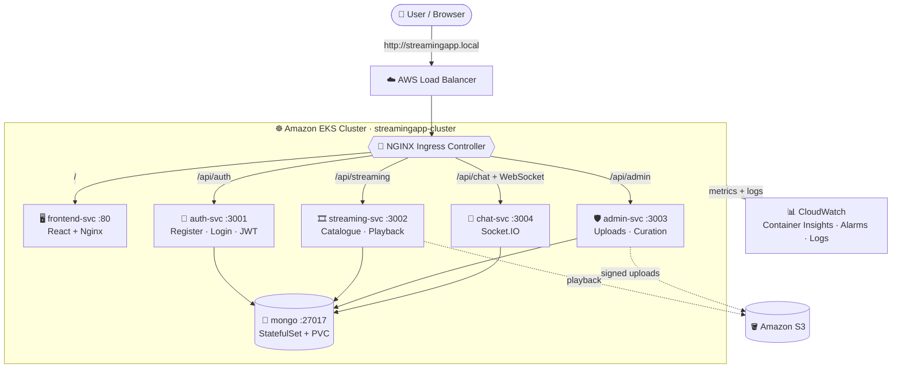
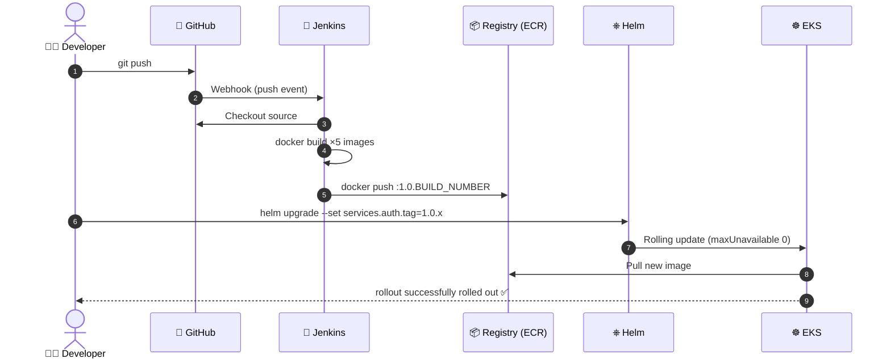
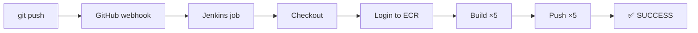
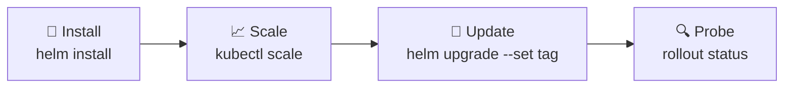
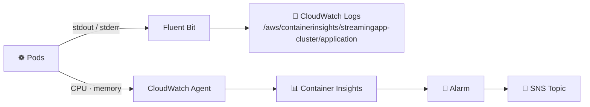
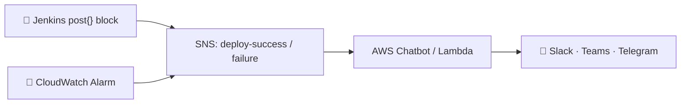

<div align="center">

# 🎬 StreamingApp on Kubernetes

### Container Orchestration & Scaling — from `git push` to a production-style cluster on AWS


**PPMCAD · DevOps Track · Multicloud Architecture in DevOps**

*A 5-service MERN streaming platform — containerized, automated, deployed with Helm, exposed through a single Ingress, scaled with zero downtime, and monitored with CloudWatch.*

</div>

---

## 📑 Table of Contents

| # | Section | # | Section |
|---|---|---|---|
| 1 | [Project Overview](#overview) | 9 | [Deploy, Scale & Zero-Downtime Update](#scale) |
| 2 | [Architecture](#architecture) | 10 | [Verification & Smoke Tests](#verify) |
| 3 | [Project Flow](#flow) | 11 | [Monitoring & Logging](#monitoring) |
| 4 | [Repository Structure](#structure) | 12 | [Bonus: ChatOps Alerts](#bonus) |
| 5 | [Prerequisites](#prereqs) | 13 | [Configuration Reference](#config) |
| 6 | [Quick Start](#quickstart) | 14 | [Production Considerations](#production) |
| 7 | [Containerization & Registry](#containers) | 15 | [Rubric Mapping](#rubric) |
| 8 | [CI (Jenkins), EKS, Manifests, Helm, Ingress](#build) | 16 | [Submission Checklist](#checklist) · [Troubleshooting](#troubleshooting) |

> 📸 **Screenshots:** every figure below points to `docs/screenshots/`. The full list of file names and what each one should show is in the [Screenshot Index](#screenshots).

---

<a id="overview"></a>
## 1️⃣ Project Overview

StreamingApp is a multi-service MERN (MongoDB, Express, React, Node) streaming platform. This project takes it from *"code on GitHub"* to *"running in Kubernetes on AWS"*, with an automated build pipeline, centralized monitoring and logging.

| 🎯 Goal | ✅ How it is achieved |
|---|---|
| Containerize a multi-service app | 5 Docker images (4 Node.js services + React/Nginx frontend), versioned `1.0.x` |
| Model the system in Kubernetes | Deployments, ClusterIP Services, ConfigMap, Secret, MongoDB StatefulSet + PVC |
| Package as a Helm chart | One chart, one `values.yaml`, whole stack installs with one command |
| Expose with Ingress | One host, 5 path-based routes (incl. WebSocket chat) |
| Scale and update safely | Replica scaling + `RollingUpdate` (`maxUnavailable: 0`, `maxSurge: 1`) |
| Verify cluster health | Liveness/readiness probes + end-to-end smoke tests + pod self-healing |
| Automate & observe | Jenkins CI to ECR, CloudWatch Container Insights, alarms, Fluent Bit logs |

---

<a id="architecture"></a>
## 2️⃣ Architecture



### Services

| Service | Internal Port | Purpose | K8s Service | Workload Type |
|---|:---:|---|---|---|
| **frontend** | `3000 → 80` | React SPA served by Nginx | `frontend-svc` | Deployment |
| **authService** | `3001` | Registration, login, JWT issuance | `auth-svc` | Deployment |
| **streamingService** | `3002` | Video catalogue, S3 playback, public API | `streaming-svc` | Deployment |
| **adminService** | `3003` | Asset management & signed uploads | `admin-svc` | Deployment |
| **chatService** | `3004` | WebSocket + REST live chat | `chat-svc` | Deployment |
| **MongoDB** | `27017` | Shared database for every service | `mongo` (headless) | **StatefulSet + PVC** |

### Ingress routing table

| Path | Backend Service | Port | Handles |
|---|---|:---:|---|
| `/` | `frontend-svc` | 80 | React SPA |
| `/api/auth` | `auth-svc` | 3001 | Login, register, JWT |
| `/api/streaming` | `streaming-svc` | 3002 | Catalogue & playback |
| `/api/admin` | `admin-svc` | 3003 | Uploads & curation |
| `/api/chat` (+ ws) | `chat-svc` | 3004 | Socket.IO chat |

---

<a id="flow"></a>
## 3️⃣ Project Flow

### End-to-end journey

```mermaid
flowchart LR
    A["🐙 1. Git<br/>Fork & clone"] --> B["🐳 2. Docker<br/>Build 5 images"]
    B --> C["📦 3. Registry<br/>Docker Hub / ECR"]
    C --> D["🤖 4. Jenkins CI<br/>Auto build & push"]
    D --> E["☸️ 5. EKS<br/>Managed cluster"]
    E --> F["📄 6. Manifests<br/>Deploy · Svc · Config"]
    F --> G["⎈ 7. Helm<br/>Templated chart"]
    G --> H["🚪 8. Ingress<br/>One entry point"]
    H --> I["📈 9. Scale & Update<br/>Zero downtime"]
    I --> J["📊 10. CloudWatch<br/>Metrics · Logs · Alarms"]
    J --> K["✅ 11. Verify<br/>Smoke tests"]

    style A fill:#24292e,color:#fff
    style B fill:#2496ED,color:#fff
    style C fill:#FF9900,color:#000
    style D fill:#D24939,color:#fff
    style E fill:#326CE5,color:#fff
    style G fill:#0F1689,color:#fff
    style H fill:#009639,color:#fff
    style J fill:#FF4F8B,color:#fff
    style K fill:#2ea44f,color:#fff
```



### CI/CD pipeline



### Phase checklist

| Phase | Task | Tools | Status |
|:---:|---|---|:---:|
| 1 | Containerize every service | Docker | ⬜ |
| 2 | Push images to registry | Docker Hub · Amazon ECR | ⬜ |
| 3 | Continuous Integration | Jenkins | ⬜ |
| 4 | Create the cluster | eksctl · EKS | ⬜ |
| 5 | Write Kubernetes manifests | kubectl | ⬜ |
| 6 | Package as Helm chart | Helm 3 | ⬜ |
| 7 | Expose with Ingress | ingress-nginx | ⬜ |
| 8 | Deploy, scale & update | Helm · kubectl | ⬜ |
| 9 | Monitoring & logging | CloudWatch | ⬜ |
| 10 | Verify & smoke test | Browser · kubectl | ⬜ |
| 11 | Document the system | Markdown | ⬜ |

> Tick the boxes (`⬜` → `✅`) as you finish each phase.

---

<a id="structure"></a>
## 4️⃣ Repository Structure

```text
StreamingApp/
├── backend/
│   ├── authService/            # :3001  + Dockerfile
│   ├── streamingService/       # :3002  + Dockerfile
│   ├── adminService/           # :3003  + Dockerfile
│   └── chatService/            # :3004  + Dockerfile
├── frontend/                   # React SPA, multi-stage Node → Nginx build
├── k8s/                        # Plain manifests (written first to learn the objects)
│   ├── configmap.yaml
│   ├── *-deployment.yaml / *-service.yaml
│   └── mongo-statefulset.yaml
├── streamingapp/               # ⎈ Helm chart
│   ├── Chart.yaml
│   ├── values.yaml             # single source of truth
│   └── templates/
│       ├── auth-deployment.yaml     ├── auth-service.yaml
│       ├── streaming-deployment.yaml├── streaming-service.yaml
│       ├── admin-deployment.yaml    ├── admin-service.yaml
│       ├── chat-deployment.yaml     ├── chat-service.yaml
│       ├── frontend-deployment.yaml ├── frontend-service.yaml
│       ├── mongo-statefulset.yaml
│       ├── configmap.yaml  ├── secret.yaml
│       └── ingress.yaml
├── Jenkinsfile                 # CI pipeline: build + push 5 images
├── docs/
│   └── screenshots/            # 📸 evidence images used in this README
├── DOCUMENTATION.md            # extended system documentation
└── README.md                   # you are here
```

---

<a id="prereqs"></a>
## 5️⃣ Prerequisites

| Tool | Purpose | Verify |
|---|---|---|
| Git | Fork, clone, push | `git --version` |
| Docker Desktop / Engine | Build & run images | `docker --version` |
| AWS CLI v2 | ECR, EKS, CloudWatch, SNS | `aws --version` |
| kubectl | Talk to the cluster | `kubectl version --client` |
| eksctl | Create the EKS cluster | `eksctl version` |
| Helm 3 | Package & install the chart | `helm version` |
| AWS account + IAM user | Access key with ECR / EKS permissions | `aws sts get-caller-identity` |
| Docker Hub account | Public image repos (`1.0.x`) | — |

<details>
<summary><b>📸 Evidence — tools installed & AWS CLI configured (click to expand)</b></summary>

> **Expected:** terminal showing the version of every tool, plus the JSON from `aws sts get-caller-identity`.

<p align="center">
  <br>
  <sub><b>Fig. 1</b> — Tool versions and AWS identity</sub>
</p>

<p align="center">
  <br>
  <sub><b>Fig. 2</b> — <code>git remote -v</code> showing <code>origin</code> (fork) and <code>upstream</code></sub>
</p>

</details>

---

<a id="quickstart"></a>
## 6️⃣ Quick Start

> Reproduce the whole deployment from a clean checkout.

```bash
# 1. Clone
git clone https://github.com/<your-username>/StreamingApp.git
cd StreamingApp

# 2. Point kubectl at the cluster
aws eks update-kubeconfig --name streamingapp-cluster --region <your-region>
kubectl get nodes                       # expect: all nodes Ready

# 3. Install the NGINX Ingress controller
helm repo add ingress-nginx https://kubernetes.github.io/ingress-nginx
helm repo update
helm install ingress-nginx ingress-nginx/ingress-nginx \
  --namespace ingress-nginx --create-namespace

# 4. Create the Secret (never commit real values)
kubectl create secret generic streamingapp-secret \
  --from-literal=JWT_SECRET='<your-jwt-secret>' \
  --from-literal=AWS_ACCESS_KEY_ID='<your-access-key>' \
  --from-literal=AWS_SECRET_ACCESS_KEY='<your-secret-key>'

# 5. Lint & install the chart
helm lint ./streamingapp
helm install streamingapp ./streamingapp

# 6. Find the Ingress address and map the hostname
kubectl get svc -n ingress-nginx        # copy EXTERNAL-IP / hostname
# add to /etc/hosts  (Windows: C:\Windows\System32\drivers\etc\hosts)
#   <EXTERNAL-IP>  streamingapp.local
```

🌐 **Open:** <http://streamingapp.local>

<!-- If your chart renders templates/secret.yaml from --set values instead of a pre-created Secret, replace step 4 with the matching --set flags. -->

---

<a id="containers"></a>
## 7️⃣ Containerization & Registry

> 🏆 **Rubric: Containerization — 20%** · all 5 images build clean, are tagged `1.0.x` and pushed.

Each service already ships a Dockerfile (reused, not rewritten). The frontend uses a multi-stage build (Node builds React → Nginx serves static files) to keep the final image slim.

<details>
<summary><b>🐳 Build commands</b></summary>

```bash
docker build -t <docker-id>/streaming-auth:1.0.0     backend/authService
docker build -t <docker-id>/streaming-stream:1.0.0   -f backend/streamingService/Dockerfile backend
docker build -t <docker-id>/streaming-admin:1.0.0    -f backend/adminService/Dockerfile     backend
docker build -t <docker-id>/streaming-chat:1.0.0     -f backend/chatService/Dockerfile      backend
docker build -t <docker-id>/streaming-frontend:1.0.0 frontend
```

</details>

### 📦 Published images

| Component | Docker Hub | Amazon ECR | Tag |
|---|---|---|:---:|
| auth | [`<docker-id>/streaming-auth`](https://hub.docker.com/r/<docker-id>/streaming-auth) | `<account-id>.dkr.ecr.<region>.amazonaws.com/streaming-auth` | `1.0.0` |
| streaming | [`<docker-id>/streaming-stream`](https://hub.docker.com/r/<docker-id>/streaming-stream) | `<account-id>.dkr.ecr.<region>.amazonaws.com/streaming-stream` | `1.0.0` |
| admin | [`<docker-id>/streaming-admin`](https://hub.docker.com/r/<docker-id>/streaming-admin) | `<account-id>.dkr.ecr.<region>.amazonaws.com/streaming-admin` | `1.0.0` |
| chat | [`<docker-id>/streaming-chat`](https://hub.docker.com/r/<docker-id>/streaming-chat) | `<account-id>.dkr.ecr.<region>.amazonaws.com/streaming-chat` | `1.0.0` |
| frontend | [`<docker-id>/streaming-frontend`](https://hub.docker.com/r/<docker-id>/streaming-frontend) | `<account-id>.dkr.ecr.<region>.amazonaws.com/streaming-frontend` | `1.0.0` |

<details>
<summary><b>🚀 Tag & push commands</b></summary>

```bash
# Docker Hub
docker login
docker push <docker-id>/streaming-<service>:1.0.0

# Amazon ECR
aws ecr create-repository --repository-name streaming-<service> --region <region>
aws ecr get-login-password --region <region> | \
  docker login --username AWS --password-stdin <account-id>.dkr.ecr.<region>.amazonaws.com
docker tag  <docker-id>/streaming-<service>:1.0.0 <account-id>.dkr.ecr.<region>.amazonaws.com/streaming-<service>:1.0.0
docker push <account-id>.dkr.ecr.<region>.amazonaws.com/streaming-<service>:1.0.0
```

</details>

### ✅ Expected output

> **Expected:** `docker images` lists all 5 images with tag `1.0.0`.

<p align="center">
  <br>
  <sub><b>Fig. 3</b> — Five locally built images</sub>
</p>

> **Expected:** Docker Hub shows all 5 repositories, each with a `1.0.x` tag and a recent push time.

<p align="center">
  <br>
  <sub><b>Fig. 4</b> — Docker Hub repositories</sub>
</p>

> **Expected:** ECR lists 5 repositories; each contains an image tagged `1.0.x` with a real size (hundreds of MB, not 0).

<p align="center">
  <br>
  <sub><b>Fig. 5</b> — Amazon ECR repositories and image tags</sub>
</p>

---

<a id="build"></a>
## 8️⃣ CI, EKS, Manifests, Helm & Ingress

### 🤖 8.1 Continuous Integration — Jenkins

A `Jenkinsfile` at the repo root checks out the code, logs in to ECR, then builds and pushes all 5 images tagged `1.0.$BUILD_NUMBER` on every push (via GitHub webhook or SCM polling).



> **Expected:** Console Output ends with `Finished: SUCCESS`; a new image tag appears in ECR.

<p align="center">
  <br>
  <sub><b>Fig. 6</b> — Jenkins build finished successfully</sub>
</p>

> **Expected:** after a small commit + push, a new build starts automatically without clicking *Build Now*.

<p align="center">
  <br>
  <sub><b>Fig. 7</b> — Build triggered automatically by a commit</sub>
</p>

---

### ☸️ 8.2 EKS Cluster

```bash
eksctl create cluster \
  --name streamingapp-cluster --region <your-region> \
  --nodegroup-name standard-workers --node-type t3.medium \
  --nodes 2 --nodes-min 2 --nodes-max 4 --managed
```

> **Expected output (sample):**
>
> ```text
> NAME                                           STATUS   ROLES    AGE   VERSION
> ip-192-168-xx-xx.<region>.compute.internal     Ready    <none>   5m    v1.xx
> ip-192-168-yy-yy.<region>.compute.internal     Ready    <none>   5m    v1.xx
> ```

<p align="center">
  <br>
  <sub><b>Fig. 8</b> — EKS worker nodes in <code>Ready</code> state</sub>
</p>

---

### 📄 8.3 Kubernetes Manifests

> 🏆 **Rubric: K8s Manifests — 20%** · Deployments, Services, ConfigMap/Secret correctly wired.

| Object | Count | Notes |
|---|:---:|---|
| Deployment | 5 | `replicas: 2`, `RollingUpdate` (`maxUnavailable: 0`, `maxSurge: 1`), readiness + liveness probes |
| Service (ClusterIP) | 5 | Stable internal DNS names |
| ConfigMap | 1 | `streamingapp-config` — non-secret env vars |
| Secret | 1 | `streamingapp-secret` — created via CLI, never committed |
| StatefulSet + PVC | 1 | MongoDB with `5Gi` `ReadWriteOnce` volume |

```bash
kubectl apply -f k8s/
kubectl get deployments,statefulsets,pods,svc
```

> **Expected:** every Deployment/StatefulSet shows `READY` = desired/desired (e.g. `2/2`); all pods `Running`, none in `CrashLoopBackOff` or `Pending`.

<p align="center">
  <br>
  <sub><b>Fig. 9</b> — Plain manifests applied, all workloads ready</sub>
</p>

---

### ⎈ 8.4 Helm Chart

> 🏆 **Rubric: Helm Chart — 20%** · fully templated, **no hardcoded values** in `templates/`.

All image names, tags, replica counts, ports, storage size and ingress host come from `values.yaml`:

```yaml
services:
  auth:
    image: <registry>/streaming-auth
    tag: "1.0.0"
    replicas: 2
    port: 3001
  # streaming (3002) · admin (3003) · chat (3004) · frontend follow the same pattern
mongo:
  storageSize: 5Gi
ingress:
  host: streamingapp.local
```

```bash
helm lint ./streamingapp
helm install streamingapp ./streamingapp
helm list
```

> **Expected:** `helm lint` → `0 chart(s) failed`; `helm list` → release `streamingapp` with `STATUS: deployed`; pods for all 5 services + mongo reach `Running`.

<p align="center">
  <br>
  <sub><b>Fig. 10</b> — <code>helm lint</code>, <code>helm install</code> and <code>helm list</code></sub>
</p>

---

### 🚪 8.5 Ingress

> 🏆 **Rubric: Ingress Routing — 15%** · all 5 paths resolve correctly through one host.

NGINX Ingress controller + one `ingress.yaml` implementing the [routing table](#architecture). The controller's `LoadBalancer` address is mapped to `streamingapp.local` in the hosts file.

```bash
kubectl get svc -n ingress-nginx     # EXTERNAL-IP of the controller
kubectl get ingress                  # streamingapp-ingress with ADDRESS filled
```

> **Expected:** `kubectl get ingress` lists `streamingapp-ingress` with an address.

<p align="center">
  <br>
  <sub><b>Fig. 11</b> — Ingress with an external address</sub>
</p>

> **Expected:** the React frontend loads at `http://streamingapp.local`.

<p align="center">
  <br>
  <sub><b>Fig. 12</b> — Frontend served through the Ingress host</sub>
</p>

> **Expected:** each `/api/*` route reaches its service (not a `404`).

| Route tested | Expected |
|---|---|
| `http://streamingapp.local/api/auth/health` | ✅ responds from auth-svc |
| `http://streamingapp.local/api/streaming/health` | ✅ responds from streaming-svc |
| `http://streamingapp.local/api/admin/health` | ✅ responds from admin-svc |
| `http://streamingapp.local/api/chat/health` | ✅ responds from chat-svc |

<p align="center">
  <br>
  <sub><b>Fig. 13</b> — All five paths resolving through one host</sub>
</p>

---

<a id="scale"></a>
## 9️⃣ Deploy, Scale & Zero-Downtime Update

> 🏆 **Rubric: Scaling & Updates — 15%** · replica scaling + rolling update demonstrated live.



### 📈 Scale

```bash
kubectl scale deploy/streaming-deployment --replicas=4
kubectl get pods -l app=streaming
```

> **Expected:** 4 `streaming` pods `Running` and `Ready`.

<p align="center">
  <br>
  <sub><b>Fig. 14</b> — <code>streaming</code> scaled from 2 to 4 replicas</sub>
</p>

### 🔄 Rolling update with zero failed requests

Terminal A — keep hitting the app:

```bash
while true; do curl -s -o /dev/null -w "%{http_code}\n" http://streamingapp.local; sleep 1; done
```

Terminal B — roll out a new version:

```bash
helm upgrade streamingapp ./streamingapp --set services.auth.tag=1.0.1
kubectl rollout status deploy/auth-deployment
```

> **Expected:** Terminal A prints `200` the whole time; Terminal B ends with `deployment "auth-deployment" successfully rolled out`.

<p align="center">
  <br>
  <sub><b>Fig. 15</b> — Rolling update; no failed requests</sub>
</p>

---

<a id="verify"></a>
## 🔟 Verification & Smoke Tests

> 🏆 **Rubric: Verification — 10%** · smoke tests pass; pod self-heal demonstrated.

A cluster with all pods `Running` is not proof the app works. Everything below is tested **through the Ingress host**, not by port-forwarding.

### 📋 Cluster state

```bash
kubectl get pods,svc,ingress -A
```

> **Expected:** every pod `Running`/`Ready` with ~0 restarts; services and ingress present.

<p align="center">
  <br>
  <sub><b>Fig. 16</b> — <code>kubectl get pods,svc,ingress -A</code> (required deliverable)</sub>
</p>

### 🧪 End-to-end checks

| ✔ | Test | What to do | Evidence |
|:---:|---|---|:---:|
| ⬜ | **Register & log in** | Create an account at `streamingapp.local`; confirm a JWT is issued (Network tab / localStorage) | Fig. 17 |
| ⬜ | **Upload via admin** | Log in as admin, upload a small video + thumbnail | Fig. 18 |
| ⬜ | **Playback** | Open the catalogue; the uploaded video plays | Fig. 19 |
| ⬜ | **Live chat** | Two tabs (normal + incognito), two users — a message sent in one appears instantly in the other | Fig. 20 |
| ⬜ | **Self-healing** | `kubectl delete pod <backend-pod>` — replacement is created, app keeps working | Fig. 21 |

<p align="center">
  <br>
  <sub><b>Fig. 17</b> — Successful registration / login (JWT received)</sub>
</p>

<p align="center">
  <br>
  <sub><b>Fig. 18</b> — Video + thumbnail uploaded through the admin dashboard</sub>
</p>

<p align="center">
  <br>
  <sub><b>Fig. 19</b> — Uploaded video playing from the catalogue</sub>
</p>

<p align="center">
  <br>
  <sub><b>Fig. 20</b> — Chat message broadcast across two browser tabs</sub>
</p>

<p align="center">
  <br>
  <sub><b>Fig. 21</b> — Pod deleted, Deployment self-heals with no user impact</sub>
</p>

---

<a id="monitoring"></a>
## 1️⃣1️⃣ Monitoring & Logging — CloudWatch



| Capability | Where to look |
|---|---|
| Metrics | CloudWatch → **Container Insights** → select `streamingapp-cluster` |
| Alarm | CloudWatch → **Alarms** → e.g. `pod_cpu_utilization > 80%` for 5 min → SNS topic |
| Logs | CloudWatch → **Log groups** → `/aws/containerinsights/streamingapp-cluster/application` |

<p align="center">
  <br>
  <sub><b>Fig. 22</b> — Live CPU / memory graphs per pod and node</sub>
</p>

<p align="center">
  <br>
  <sub><b>Fig. 23</b> — Alarm configured (state <code>OK</code> or <code>INSUFFICIENT_DATA</code>)</sub>
</p>

<p align="center">
  <br>
  <sub><b>Fig. 24</b> — Centralized pod logs (e.g. "Server listening on port 3001")</sub>
</p>

---

<a id="bonus"></a>
## 1️⃣2️⃣ Bonus — ChatOps Alerts *(optional, extra credit)*

CloudWatch alarms and Jenkins build results are published to **SNS** topics (`streamingapp-deploy-success`, `streamingapp-deploy-failure`) and forwarded to a chat channel (Slack / Teams / Telegram).



<p align="center">
  <br>
  <sub><b>Fig. 25</b> — Real alert delivered to the chat channel after a pipeline run</sub>
</p>

---

<a id="config"></a>
## 1️⃣3️⃣ Configuration Reference

> Names only — **never commit real secret values.**

| Type | Key | Purpose |
|---|---|---|
| ConfigMap `streamingapp-config` | `AWS_REGION` | AWS region for S3 / services |
| ConfigMap `streamingapp-config` | `MONGO_HOST` | `mongo.default.svc.cluster.local` |
| ConfigMap `streamingapp-config` | `CLIENT_URLS` | Allowed frontend origin(s) |
| ConfigMap `streamingapp-config` | `PORT` | Service port (per service) |
| Secret `streamingapp-secret` | `JWT_SECRET` | Signs / verifies JWTs |
| Secret `streamingapp-secret` | `AWS_ACCESS_KEY_ID` | S3 access |
| Secret `streamingapp-secret` | `AWS_SECRET_ACCESS_KEY` | S3 access |

<!-- Add any extra env vars your services use (e.g. MONGO_URI). -->

---

<a id="production"></a>
## 1️⃣4️⃣ Production Considerations

For a production cluster I would run each environment in its own **namespace** with resource quotas and network policies, so services can only talk to what they need. I would enable **TLS** on the Ingress with a cert-manager–issued certificate, and add **Horizontal Pod Autoscalers** (CPU / memory based) so replica counts follow load instead of being set by hand. MongoDB would move to a managed service (Amazon DocumentDB or MongoDB Atlas) with backups, and secrets would come from AWS Secrets Manager or External Secrets rather than `kubectl create secret`. I would also pin images by digest, set resource requests/limits on every container, use IRSA instead of static AWS keys, and gate deployments behind the Jenkins pipeline.

<!-- Edit this paragraph to reflect your own view — the assignment asks for one paragraph on namespaces, TLS and HPA. -->

---

<a id="rubric"></a>
## 1️⃣5️⃣ Rubric Mapping

Where to find the evidence for each marking criterion:

| Criterion | What is checked | Weight | Evidence in this README |
|---|---|:---:|---|
| 🐳 **Containerization** | All 5 images build clean, tagged & pushed | **20%** | [Section 7](#containers) · Figs. 3–5 |
| 📄 **K8s Manifests** | Deployments, Services, ConfigMap/Secret correctly wired | **20%** | [Section 8.3](#build) · Fig. 9 |
| ⎈ **Helm Chart** | Fully templated — no hardcoded values in `templates/` | **20%** | [Section 8.4](#build) · Fig. 10 |
| 🚪 **Ingress Routing** | All 5 paths resolve through one host | **15%** | [Section 8.5](#build) · Figs. 11–13 |
| 📈 **Scaling & Updates** | Replica scaling + rolling update demonstrated live | **15%** | [Section 9](#scale) · Figs. 14–15 |
| ✅ **Verification** | Smoke tests pass; pod self-heal demonstrated | **10%** | [Section 10](#verify) · Figs. 16–21 |
| | | **100%** | |

> Weights are indicative; the instructor may adjust per batch.

---

<a id="checklist"></a>
## 1️⃣6️⃣ Submission Checklist

- [ ] Public GitHub repo with the Helm chart (`Chart.yaml`, `values.yaml`, `templates/`), `k8s/` manifests, `Jenkinsfile`
- [ ] Docker Hub links for all 5 images, tagged `1.0.x` (and ECR images pushed)
- [ ] This README with exact install steps (`helm install …`) and how to reach the app via Ingress
- [ ] Screenshot of `kubectl get pods,svc,ingress -A` — everything Running (**Fig. 16**)
- [ ] Screenshots of the running app: login, one upload, chat across two tabs (**Figs. 17, 18, 20**)
- [ ] Scaling and rolling update demonstrated with zero failed requests (**Figs. 14–15**)
- [ ] CloudWatch: live metrics, at least one alarm, centralized logs (**Figs. 22–24**)
- [ ] One-paragraph production note ([Section 14](#production))
- [ ] `DOCUMENTATION.md` pushed
- [ ] *(Bonus)* ChatOps alert delivered (**Fig. 25**)
- [ ] Repository link submitted via Vlearn before the deadline

---

<a id="troubleshooting"></a>
## 🛠️ Troubleshooting

<details>
<summary><b>Click to expand quick fixes</b></summary>

| Symptom | Likely cause | Fix |
|---|---|---|
| `ImagePullBackOff` | Wrong image path/tag, or expired registry credentials | `kubectl describe pod <n>`; verify `image:`; re-run registry login |
| `CrashLoopBackOff` | Missing env var / bad Mongo URI | `kubectl logs <pod> --previous` |
| Ingress `404` | Path or service name/port mismatch | Re-check the routing table; `kubectl describe ingress` |
| `helm upgrade` does nothing | Edited template but not `values.yaml`, or missing `--set` | `helm upgrade … --dry-run --debug` |
| Jenkins fails at `docker login` | AWS credentials missing / expired in Jenkins | Re-check the stored credential |
| `kubectl` cannot connect | Stale kubeconfig | `aws eks update-kubeconfig --name streamingapp-cluster --region <region>` |

</details>

---

<a id="screenshots"></a>
## 📸 Screenshot Index

Save every image in **`docs/screenshots/`** using exactly these file names so the figures above render.

| Fig. | File name | Should show |
|:---:|---|---|
| 1 | `01-prereq-versions.png` | Version output of git, docker, aws, kubectl, eksctl, helm + `aws sts get-caller-identity` |
| 2 | `02-git-remotes.png` | `git remote -v` with `origin` and `upstream` |
| 3 | `03-docker-images.png` | `docker images` — 5 images tagged `1.0.0` |
| 4 | `04-docker-hub-repos.png` | Docker Hub repos with `1.0.x` tags |
| 5 | `05-ecr-repos.png` | ECR repositories and image tags/sizes |
| 6 | `06-jenkins-build-success.png` | Jenkins console ending in `Finished: SUCCESS` |
| 7 | `07-jenkins-auto-trigger.png` | Build started automatically by a commit |
| 8 | `08-eks-nodes.png` | `kubectl get nodes` — all `Ready` |
| 9 | `09-k8s-manifests-applied.png` | `kubectl get deployments,statefulsets,pods,svc` |
| 10 | `10-helm-lint-install.png` | `helm lint`, `helm install`, `helm list` |
| 11 | `11-ingress-address.png` | `kubectl get ingress` with an address |
| 12 | `12-app-home-via-ingress.png` | Frontend at `streamingapp.local` |
| 13 | `13-ingress-api-routes.png` | `curl` / browser results for all `/api/*` routes |
| 14 | `14-scale.png` | `streaming` scaled to 4 replicas |
| 15 | `15-rolling-update-zero-downtime.png` | `200` loop + `rollout status` success |
| 16 | `16-all-resources.png` | `kubectl get pods,svc,ingress -A` |
| 17 | `17-login.png` | Successful login / JWT |
| 18 | `18-admin-upload.png` | Admin upload of video + thumbnail |
| 19 | `19-playback.png` | Video playing in the catalogue |
| 20 | `20-chat-two-tabs.png` | Chat visible in two tabs |
| 21 | `21-pod-self-heal.png` | Deleted pod replaced automatically |
| 22 | `22-cloudwatch-container-insights.png` | Container Insights graphs |
| 23 | `23-cloudwatch-alarm.png` | CloudWatch alarm |
| 24 | `24-cloudwatch-logs.png` | Log group / stream with pod logs |
| 25 | `25-sns-chatops.png` | *(Bonus)* Alert in Slack / Teams / Telegram |

> 💡 **Tip:** crop to the relevant terminal/browser area, keep text readable (≥ 800 px wide), and **blank out account IDs, access keys and secrets** before committing.

---

<div align="center">

**Built for the PPMCAD DevOps Track · Multicloud Architecture in DevOps**

⭐ If this helped, star the repo · 🍴 Forked from [UnpredictablePrashant/StreamingApp](https://github.com/UnpredictablePrashant/StreamingApp)

</div>
